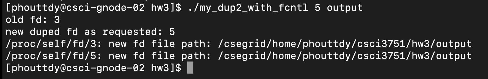
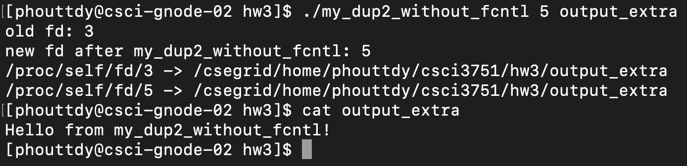
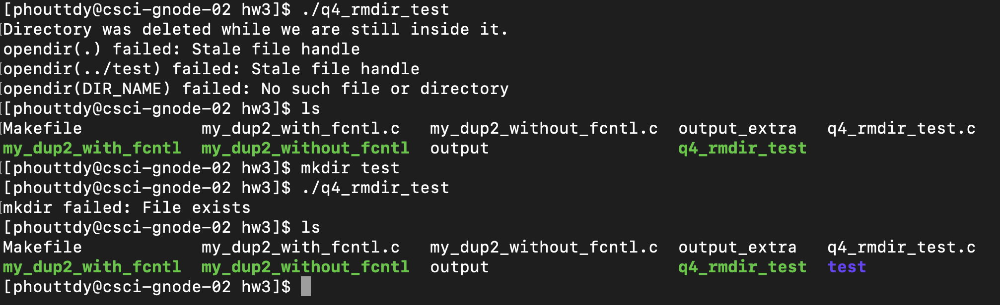

**Dylan Phoutthavong**

**February 17th, 2025**

**CSCI 3751: Fundamentals of UNIX**

# Homework 3

## 1. [15 points] implement my_dup2_with_fcntl()


**Makefile**:


**Code**:
```
#include <stdio.h>
#include <stdlib.h>
#include <unistd.h>
#include <fcntl.h>
#include <string.h>
#include <errno.h>

int my_dup2_with_fcntl(int oldfd, int newfd) {
    if (oldfd == newfd) return newfd;

    close(newfd);  // ensure it's closed
    int dup_fd = fcntl(oldfd, F_DUPFD, newfd);
    if (dup_fd < 0) {
        perror("fcntl failed");
        return -1;
    }
    return dup_fd;
}

void print_fd_path(int fd) {
    char path[256], buf[256];
    snprintf(path, sizeof(path), "/proc/self/fd/%d", fd);
    ssize_t len = readlink(path, buf, sizeof(buf)-1);
    if (len != -1) {
        buf[len] = '\0';
        printf("%s: new fd file path: %s\n", path, buf);
    } else {
        perror("readlink failed");
    }
}

int main(int argc, char *argv[]) {
    if (argc != 3) {
        fprintf(stderr, "usage: %s <new_fd> <file>\n", argv[0]);
        exit(1);
    }

    int newfd = atoi(argv[1]);
    const char *filename = argv[2];

    int oldfd = open(filename, O_WRONLY | O_CREAT | O_TRUNC, 0644);
    if (oldfd < 0) {
        perror("open failed");
        exit(1);
    }

    int dupfd = my_dup2_with_fcntl(oldfd, newfd);
    if (dupfd < 0) exit(1);

    printf("old fd: %d\nnew duped fd as requested: %d\n", oldfd, dupfd);
    print_fd_path(oldfd);
    print_fd_path(dupfd);

    close(oldfd);
    close(dupfd);
    return 0;
}

```

**Output**:


### <mark>[Extra credit: 5 points]
Do the same without using fcntl() (my_dup2_without_fcntl) as stated in the problem 3.2 on [APUE] page 90.

**NOTE: Proper error checking for system calls is important part of this homework.
Every system call should be guarded by rigorously checking for errors. A penalty of
-1 point will be applied for each missed error check.**

**Code**:
```
#include "apue.h"
#include <fcntl.h>
#include <unistd.h>
#include <stdlib.h>
#include <stdio.h>
#include <string.h>
#include <errno.h>

/* Re-implementation of dup2 without using fcntl */
int my_dup2_without_fcntl(int oldfd, int newfd) {
    if (oldfd == newfd) return newfd;

    if (close(newfd) < 0 && errno != EBADF) {
        perror("close failed");
        return -1;
    }

    int tmp_fds[1024];
    int i = 0;
    int fd;

    /* Duplicate until we get newfd */
    while ((fd = dup(oldfd)) != newfd) {
        if (fd < 0) {
            perror("dup failed");
            while (i > 0) close(tmp_fds[--i]);
            return -1;
        }
        tmp_fds[i++] = fd;
    }

    /* Cleanup intermediate FDs */
    while (i > 0) close(tmp_fds[--i]);
    return newfd;
}

void print_fd_path(int fd) {
    char path[256], buf[256];
    snprintf(path, sizeof(path), "/proc/self/fd/%d", fd);
    ssize_t len = readlink(path, buf, sizeof(buf) - 1);
    if (len != -1) {
        buf[len] = '\0';
        printf("%s -> %s\n", path, buf);
    } else {
        perror("readlink failed");
    }
}

int main(int argc, char *argv[]) {
    if (argc != 3) {
        fprintf(stderr, "usage: %s <new_fd> <file>\n", argv[0]);
        exit(1);
    }

    char *endptr;
    int newfd = strtol(argv[1], &endptr, 10);
    if (*endptr != '\0') {
        fprintf(stderr, "Invalid new_fd: must be an integer\n");
        exit(1);
    }

    const char *filename = argv[2];

    int oldfd = open(filename, O_WRONLY | O_CREAT | O_TRUNC, 0644);
    if (oldfd < 0) {
        perror("open failed");
        exit(1);
    }

    int dupfd = my_dup2_without_fcntl(oldfd, newfd);
    if (dupfd < 0) {
        close(oldfd);
        exit(1);
    }

    printf("old fd: %d\nnew fd after my_dup2_without_fcntl: %d\n", oldfd, dupfd);
    print_fd_path(oldfd);
    print_fd_path(dupfd);

    if (dprintf(dupfd, "Hello from my_dup2_without_fcntl!\n") < 0) {
        perror("write failed");
    }

    close(oldfd);
    close(dupfd);
    return 0;
}
```

**Output**:


## 2. [5 points] Solve problem 3.3 on page 90 of the textbook.


**Diagram**:


 1. **fcntl(fd1, F_SETFD, …)**
    -  Affects only `fd1`
    -  `F_SETFD` modifies the **descriptor flags** (like `FD_CLOEXEC`), which are per **descriptor**, not shared.
  
1. **fcntl(fd1, F_SETFL, …)**
   - **Affects both** `fd1` **and** `fd2`
   - `F_SETFL` modifies the **file status flags** (like `O_APPEND`, `O_NONBLOCK`), which are stored in the **shared file table entry**
   - `fd3` is **not affected**, because it refers to a **separate file table entry**

- `fd1` and `fd2` share the **same file table entry**
- `fd3` points to a **separate file table entry**

## 3. [10 points] Explain the difference between soft link and hard link and show your own step-by-step example demonstrating the differences between two link types. You may refer to the class power point slides to start with.

### Hard Link
A **hard link** is a directory entry that maps a filename directly to an inode (the underlying file data). Multiple filenames can point to the **same inode**.

- Created with: `ln original.txt hardlink.txt`

- Shares the **same inode number** as the original

- Changes made via either file affect the same data

- Deleting the original file **does not remove the data** as long as another hard link exists

- **Cannot span across filesystems**

- **Cannot be used on directories** (to avoid loops)

### Soft Link (Symbolic Link)
A **soft link** (or symlink) is a special file that contains a **pathname to another file**.

- Created with: `ln -s original.txt softlink.txt`

- Has a **different inode number**

- If the target file is removed, the symlink becomes a **dangling (broken) link**

- Can span filesystems

- Can point to directories

**Test Example**:


**Summary**:
| Feature | Hard Link | Soft Link (Symlink) |
| ----- | ----- | ----- |
|Inode shared? | Yes | No|
|Works after original deleted?| Yes | No (becomes broken) |
|Cross-filesystem?| No | Yes |
|Points to directories? | No (restricted) | Yes |
|Type (in ls -l) | Regular file | l (symlink) |

## 4. [5 points] With the following sequence of function calls in a C program, answer the following questions:
```
[]...]
#define DIR_PERM 0777
#define DIR_NAME "/csegrid/home/<your login>/tmp/hw3"
[...]
    if (mkdir(DIR_NAME, DIR_PERM) < 0)
        err_sys("mkdir failed");
    if (chdir(DIR_NAME) < 0)
        err_sys("chdir failed");
    if (rmdir(DIR_NAME) < 0)
        err_sys("rmdir failed");

```
### 1) Does rmdir(2) succeed?
**Yes**, `rmdir()` **does succeed**.

- The directory is empty (only `.` and `..` exist), so it can be deleted.

- The current working directory becomes “**unlinked**” — it's still valid for the process that has it open, but no longer accessible by pathname.

### 2) If so, what happens when the program tries to read the current directory? Test it with the following three directory specifiers to access the deleted directory. You may use opendir(DIR_NAME) C library function calls to access the directory.
- .
- ../hw3
- DIR_NAME ( == "/csegrid/home/<your login>/tmp/hw3")

| Path | Result |
| :-----: | ----- |
| `.`   | ✅ Succeeds — still refers to current directory for the process |
| `../hw3` | ❌ Fails — path no longer valid (hw3 was deleted) |
| `DIR_NAME` | ❌ Fails — same as above, full path no longer exists |

- After deletion:
  - `opendir(".")` succeeds — the process still has a reference to the now-unlinked directory.
  - `opendir("../hw3")` and `opendir(DIR_NAME)` fail with `ENOENT` because the directory name no longer exists in the filesystem.

### 3) Write your own small program to demonstrate that your answer is valid.

**Code**:
```
#include "apue.h"
#include <dirent.h>
#include <errno.h>

#define DIR_PERM 0777
#define DIR_NAME "/csegrid/home/phouttdy/csci3751/hw3/test"

void try_opendir(const char *label, const char *path) {
    DIR *dp = opendir(path);
    if (dp == NULL) {
        printf("opendir(%s) failed: %s\n", label, strerror(errno));
    } else {
        printf("opendir(%s) succeeded\n", label);
        closedir(dp);
    }
}

int main() {
    if (mkdir(DIR_NAME, DIR_PERM) < 0)
        err_sys("mkdir failed");

    if (chdir(DIR_NAME) < 0)
        err_sys("chdir failed");

    if (rmdir(DIR_NAME) < 0)
        err_sys("rmdir failed");

    printf("Directory was deleted while we are still inside it.\n");

    try_opendir(".", ".");
    try_opendir("../test", "../test");
    try_opendir("DIR_NAME", DIR_NAME);

    return 0;
}
```

**Test Output**:


### Explantion:
- `opendir(".") failed: Stale file handle`
  - This happens **because I am still inside a directory that has been deleted**.
  - Some systems (like NFS or specific kernel settings) report a “stale file handle” when a directory you're inside has been unlinked.
  - **This is still valid behavior** and supports my answer — it shows that while the file descriptor exists, the directory entry is gone.

- `opendir(../test)` **and** `opendir(DIR_NAME)` **failed**
  - These fail because the directory entry `/csci3751/hw3` no longer exists.
  - Matches expectations from question **2**.

## 5. [5 points] What’s the end effect of the following two statements called in succession? 
(**Hint**: Explain them in terms of the stdio and kernel buffers.) Please note that fflush(3) is C library function calls but fsync(2) is a system call. Also notice the function argument difference between file pointer (* FILE) and file descriptor (int)

`fflush(aFilePointer);`

`fsync(fileno(aFilePointer));`

### Overview:
- `fflush(FILE *stream)`
  - **C library function (stdio)**.
  - This flushes the **user-space (stdio) buffer** to the **kernel buffer**.
  - At this point, the data is still **in memory**, not yet on disk.

- `fsync(int fd)`
  - This is a **system call**.
  - It flushes the **kernel buffer to disk**, ensuring physical persistence.
  - Uses the file descriptor (e.g., from `fileno()`).

### Analogy:
1. `fflush()` is like saving your Word document — it's saved in your computer’s memory (RAM).
2. `fsync()` is like unplugging your flash drive only after writing is guaranteed to reach the disk.

### Conclusion: 
**The combination of** `fflush(aFilePointer);` **followed by** `fsync(fileno(aFilePointer));` **ensures that all buffered data is fully written from user space to disk**.

- `fflush()` transfers data from the **stdio buffer (user space)** to the **kernel buffer**.
- `fsync()` transfers data from the **kernel buffer** to the **actual storage device**.

This guarantees that data is not only logically written from the program’s perspective, but also physically stored on disk, making it safe from crashes or power loss.

